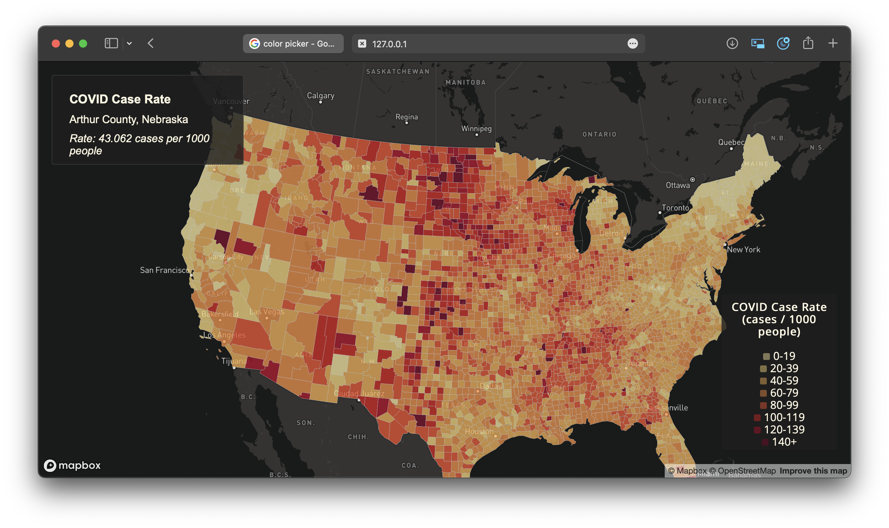

# COVID-19 Visualizations

### Introduction
This lab visualizes COVID19 Rates and Cases in the United States. It uses Albers projection, which is a conic projection often used in US election maps.
### Screenshots

Map 1 is a choropleth map of COVID19 case rates per 1000 residents at the county level. This utilizes equal interval breaks because the data looks relatively evenly distributed, so I did not use quantile breaks. It also seemed like a natural way to present the data. Here is a link to [the map](https://gavinpereira23.github.io/COVID19-visualizations/map1.html).

Map 2 is a proportional symbol map that displays the number of cases at the county level. It uses size and color to symbolize larger case numbers. It also uses red to symbolize that more cases is worse. Here is a link to [the map](https://gavinpereira23.github.io/COVID19-visualizations/map2.html)
### Acknowledgement + Sources
The data is from the New York Times github. The basemap and library are both from Mapbox. Mapshaper via NPM was used to simplify and convert the data to geoJSON format. Some of the code is also taken from the assignment in Lab 3.
